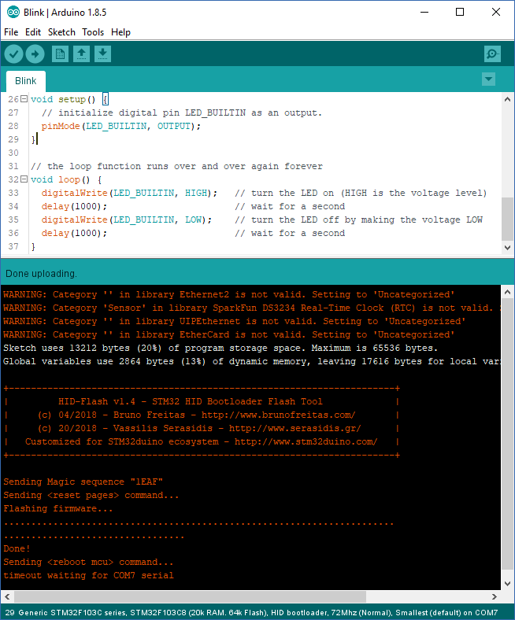

STM32_HID_bootloader
=============

## Notice

This software is experimental and a work in progress. Under no circumstances should these files be used in relation to any critical system(s). Use of these files is at your own risk.

## THE SOFTWARE IS PROVIDED "AS IS", WITHOUT WARRANTY OF ANY KIND, EXPRESS OR IMPLIED, INCLUDING BUT NOT LIMITED TO THE WARRANTIES OF MERCHANTABILITY, FITNESS FOR A PARTICULAR PURPOSE AND NONINFRINGEMENT. IN NO EVENT SHALL THE AUTHORS OR COPYRIGHT HOLDERS BE LIABLE FOR ANY CLAIM, DAMAGES OR OTHER LIABILITY, WHETHER IN AN ACTION OF CONTRACT, TORT OR OTHERWISE, ARISING FROM, OUT OF OR IN CONNECTION WITH THE SOFTWARE OR THE USE OR OTHER DEALINGS IN THE SOFTWARE.


## Summary
This is a driverless (no USB drivers needed, even on Windows) USB HID bootloader
for STM32F10X devices. 

It doesn't use ST libraries since they are bloated and buggy. Only CMSIS and
some required system files and macros have been used from ST provided SDK.

This allowed for a very small bootloader 4KB!


This repo is based on **bootsector's**  [stm32-hid-bootloader](https://github.com/bootsector/stm32-hid-bootloader) repository but is customized to follows the [STM32duino](https://github.com/rogerclarkmelbourne/Arduino_STM32) ecosystem requirements. The source files can be compiled on ***Windows***, ***Linux*** or ***Mac***


## CLI folder

`cli` folder contains the source code for creating the command line tool **hid-flash.exe** tool. 
This bootloader should't have any compiler restrictions, so it should work with
any GCC ARM toolchain version (latest is always recommended!). Just run 'make' on that folder.

### Examples:

```D:\STM32_HID_bootloader\cli>make``` Creates the **hid-flash.exe** file

```D:\STM32_HID_bootloader\cli>make clean``` Clears the previous generated files

## Bootloader folder
`bootloader` folder contains the source code for creating the **hid_bootloader.bin** file that is burned into the STM32F103 flash memory. Currently, only **STM32F103** MCU is supported. Making the ***hid_bootloader.bin***

### Examples:
```D:\STM32_HID_bootloader\bootloader>make``` Creates the **hid_bootloader.bin** file

```D:\STM32_HID_bootloader\bootloader>make clean``` Clears the previous generated files

### Screenshot

<p align="center">

</p>